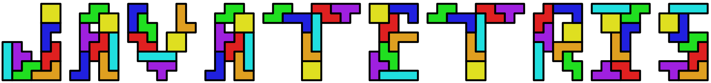

<!-- README file mainly for GitHub -->



# JavaTetris 
#### ein SEW Projekt von 
### [Severin](https://github.com/einsev) und [Roman](https://github.com/Ixpiria)
#### im Jahr 2022 | 2CI


## ❓ Was ist JavaTetris
JavaTetris ist ein Klon des beliebten Retrospiels "[Tetris](https://de.wikipedia.org/wiki/Tetris)",
welches man auf [tetris.com](https://tetris.com) kostenlos spielen kann. Jedoch wird dieses Programm mit verschiedenen
Modi und Statistikübersichten erweitert, reizt mit Leaderboards und wird von Hintergrundmusik musikalisch untermalt.<br>
*(aus [Pflichtenheft](#📔-Pflichtenheft))*


## 📔 Pflichtenheft
Pflichtenheft v1 findet man [hier](./Ressourcen/Pflichtenheft/JavaTetris_Pflichtenheft_v1.pdf). <br>
Ansonsten ist [hier](./Ressourcen/Pflichtenheft/) der Ordner dazu.

OneDrive: [Link](https://htl3r-my.sharepoint.com/:b:/g/personal/0212_htl_rennweg_at/EcUWClppGLpKqXtuq-EtV0cBfFmAxHpPJ83YAG8JLMawxA?e=5mcyBq)

## 🗺️ Roadmap
- [x] 17 Februar: Projekt erstellt
- [x] 22 Februar: Vorstellung Pflichtenheft u. Projekt: 95%
- [ ] 22 März: Zwischenabgabe mit erstem lauffähigen Prototyp
- [ ] 19 April: Finale Abgabe

## 📄 GIT
Repository am Schul-Git-Server:&nbsp;`21_2ci/public/projekt02_JavaTetris` <br>
Repository auf GitHub: &nbsp; &nbsp; &nbsp; &nbsp; &nbsp; &nbsp; &nbsp; &nbsp;`https://github.com/EinSev/JavaTetris`
<br>
<br>
**in IntelliJ**
<br>
#### Clone
```
# IntelliJ > File > New > Project from Version Control
URL: git@netzwerktechnik.htl.rennweg.at:21_2ci/public/projekt02_JavaTetris
```

#### Commit
```
git add <Files die geändert wurden>
git commit -m "<Änderungsnachricht>"
```

#### Pull
```
git pull
```

#### Push (auf beide Repos): <br>
***Vorbereitung:***
```
git remote add all git@netzwerktechnik.htl.rennweg.at:21_2ci/public/projekt02_JavaTetris
git remote set-url --add --push all https://github.com/einsev/JavaTetris.git
git remote set-url --add --push all git@netzwerktechnik.htl.rennweg.at:21_2ci/public/projekt02_JavaTetris
```

***Push***
```
git push all master

# Alias erstellen:
git config --global alias.pall 'push all master'
# dann Pushen mit
git pall
```

